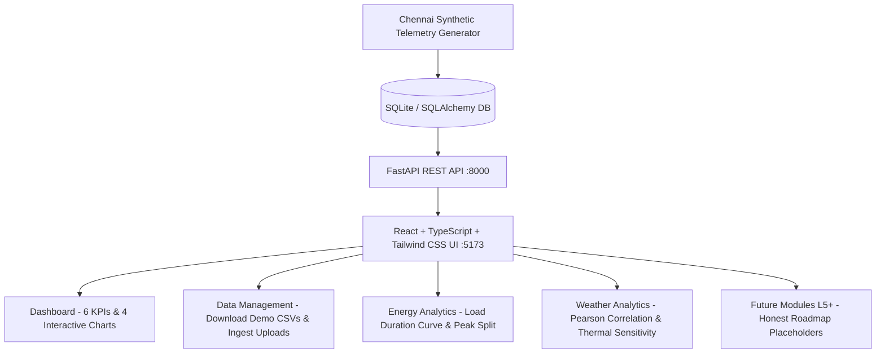

# Walkthrough — ECO AI (Levels 1 to 4)

**ECO AI — AI + IoT Smart Energy Management System** has been fully implemented covering **Levels 1 through 4**.

> **Application Tagline:** *Predict. Monitor. Optimize. Save.*

---

## 1. Architectural Overview & Implemented Scope

---

## 2. Implemented Levels Breakdown

### Level 1 — Project Foundation
- **Branding & Tagline:** Consistent **ECO AI** and tagline **"Predict. Monitor. Optimize. Save."** in browser title, sidebar, header, dashboard, about page, and footer.
- **Navigation:** 16-item sidebar with visual indicators for active modules (L1–4) and roadmap modules (L5+).
- **"Why is this built? / What does it do?" Cards:** Prominently featured on every major page.
- **Dashboard:** 6 real database-driven KPI cards (Current Usage, Today's Consumption, Average Consumption, Peak Consumption, Temperature, Humidity).
- **Interactive Visualizations:**
  - *Energy Consumption Over Time*: 24h, 7d, 30d, and Custom date ranges.
  - *Temperature vs. Energy Consumption*: Thermal coupling scatter plot illustrating cooling escalation.
  - *Daily Energy Consumption*: Bar chart of aggregated megawatt-hours per calendar day.
  - *Appliance Energy Distribution*: Donut chart & breakdown table calculating exact percentage allocations.

### Level 2 — Database + Realistic Demo Data
- **Database Engine:** SQLite configured via modular SQLAlchemy models (`energy_readings`, `weather_readings`, `appliances`, `appliance_readings`, `datasets`, `settings`), ready for migration to PostgreSQL.
- **Correlated Chennai Synthetic Generator:**
  - Diurnal temperature and humidity cycle across the day.
  - Diurnal electricity demand (morning peak, afternoon cooling surge, evening domestic peak).
  - Thermal sensitivity: cooling demand escalates when ambient temperature exceeds $28.0^\circ\text{C}$ ($\sim 22.5\text{ MW/}^\circ\text{C}$).
  - Weekday vs. weekend load profiles.
  - Sub-metered appliance allocations (Master Bed AC, Living Room AC, BLDC Fans, Refrigerator, Smart Lighting, Other).

### Level 3 — Dataset Management
- **Download Demo Datasets Center:**
  - *Chennai Energy Dataset* (`chennai_energy_synthetic.csv` — 720 rows)
  - *Chennai Weather Dataset* (`chennai_weather_synthetic.csv` — 720 rows)
  - *Chennai Appliance Dataset* (`chennai_appliance_synthetic.csv` — 4,320 rows)
  - *Download All (Combined)* (`chennai_full_combined_synthetic.csv` — 720 rows)
  - Explicit **"Demo / Synthetic Data"** labeling for academic integrity.
- **Dataset Upload & Validation:** Ingests CSV files, verifies required timestamp/consumption/temperature columns, and tracks metadata.
- **Active Datasets Registry & Tabular Preview:** Interactive modal displaying actual stored rows and columns.

### Level 4 — Weather and Energy Analytics
- **Energy Analytics Page:**
  - Peak demand share ($57.8\%$) vs. off-peak share ($42.2\%$).
  - 24-hour comparative curve: Weekday Average vs. Weekend Average.
  - Load Duration Curve (LDC) sorting hours by exceeded load.
- **Weather Page:**
  - Real-time atmospheric cards (Temperature, Humidity, Wind Speed, Conditions).
  - Pearson correlation coefficient ($r > 0.85$) between temperature and energy consumption.
  - 30-day meteorological condition frequency histogram.

### Level 5+ Roadmap Modules
The remaining future modules display clean, professional **"Coming in a future phase"** roadmap views with planned capabilities and zero misleading fake controls:
1. AI Energy Forecast
2. Live Monitoring
3. Appliances
4. Recommendations
5. Alerts
6. IoT Devices
7. Reports

---

## 3. How to Run and Access

Both services are currently active:
- **Frontend URL:** [http://127.0.0.1:5173/](http://127.0.0.1:5173/)
- **Backend API & Swagger Docs:** [http://127.0.0.1:8000/docs](http://127.0.0.1:8000/docs)

### Verification Commands Run:
- Database auto-seed generated **720 energy readings**, **720 weather readings**, **6 appliances**, **4,320 appliance readings**, and **4 cataloged datasets**.
- API endpoints confirmed returning live numbers:
  - Current usage: `895.31 MW`
  - Today's consumption: `8,970.18 MW`
  - Average consumption: `672.30 MW`
  - Peak consumption: `896.50 MW`
  - Latest temperature: `37.2°C`
  - Latest humidity: `55.9%`
  - All 4 demo CSV downloads tested and returning verified rows.
